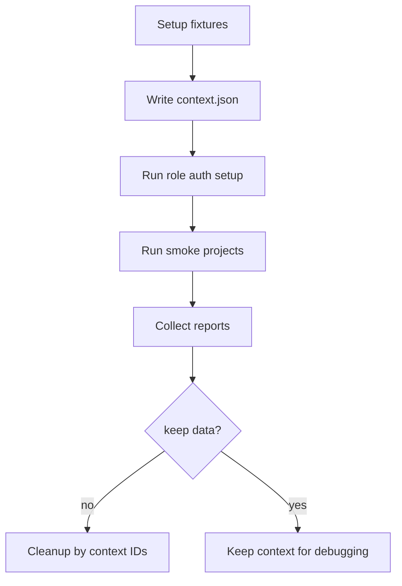

# Business Flow Engine

Status: ACTIVE (foundation)  
Owner: POS Platform  
Last Reviewed: 2026-02-20

## 1. Purpose

Provide a deterministic automation engine for delivery business flows that can be reused by:

1. UI consistency checks
2. Smoke tests
3. Future full end-to-end workflow assertions

This separates data lifecycle concerns from UI-only route assertions.

## 2. Design Principle

Use one control-tower entrypoint and modular internals.

1. Control tower: `scripts/automation/business-flow/index.mjs`
2. Deterministic setup: `scripts/automation/business-flow/steps/setup.mjs`
3. Deterministic cleanup: `scripts/automation/business-flow/steps/cleanup.mjs`
4. Smoke orchestration: `scripts/automation/business-flow/steps/smoke.mjs`
5. Shared contracts/paths: `scripts/automation/business-flow/contracts.mjs`

## 3. Engine Cycle

## 4. Setup Contract

Current setup creates deterministic records with trace tags:

1. one `CHECKED_IN` delivery run
2. one `CLOSED` delivery run
3. one delivery order linked to each run
4. route context output for manager/rider/cashier smoke usage

Artifacts:

1. `docs/automation/business-flow/runs/<timestamp>/context.json`
2. `docs/automation/business-flow/runs/<timestamp>/summary.md`
3. `test-results/automation/business-flow/context.latest.json`
4. `test-results/automation/business-flow/summary.latest.md`

## 5. Commands

1. `npm run automation:flow:setup`
2. `npm run automation:flow:smoke`
3. `npm run automation:flow:cleanup`

Optional env:

1. `FLOW_TAG_PREFIX` (default `AUTO-BFLOW`)
2. `FLOW_KEEP_DATA=1` (skip cleanup after smoke)
3. `FLOW_PROJECTS=manager-flow-desktop,rider-flow-desktop,cashier-flow-desktop`
4. `FLOW_CLEANUP_SWEEP_PREFIX=<prefix>` (bulk cleanup by code prefix)

## 6. Smoke Test Scope

Smoke projects under `tests/automation/business-flow/` currently validate:

1. manager routes on checked-in run
2. rider check-in route on checked-in run
3. cashier shift + cashier run remit route on closed run

## 7. Scaling Rules

When extending this engine:

1. add new flow steps under `scripts/automation/business-flow/steps/`
2. keep setup output schema backward-compatible
3. avoid direct hardcoded IDs in tests
4. prefer context-driven routes and record IDs
5. keep cleanup idempotent and scoped by explicit IDs/tags

## 8. Current Boundary

This foundation does not yet automate full interaction actions (create order via UI, assign rider via UI, dispatch click-flow, remit posting click-flow).  
It provisions deterministic records directly for reliable route-level smoke checks first.
