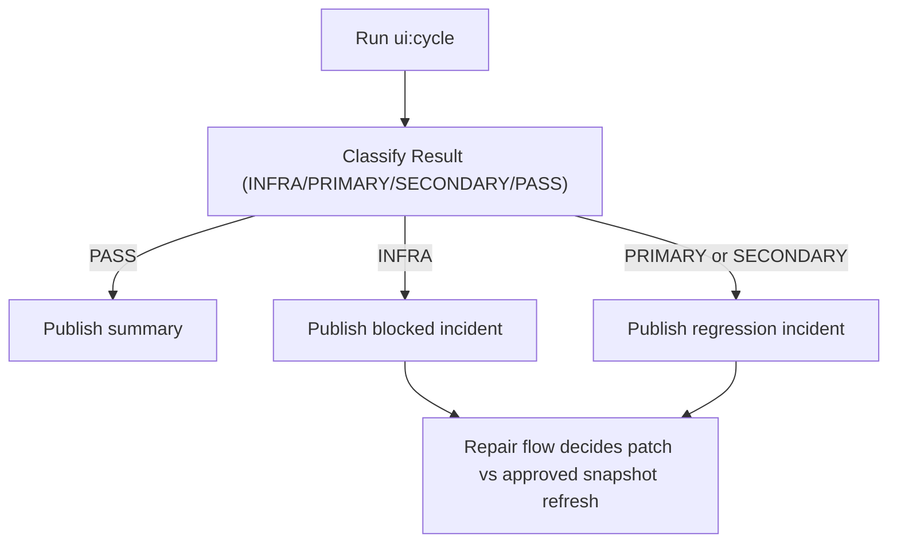

# UI Cycle Runbook

Status: ACTIVE  
Owner: POS Platform  
Last Reviewed: 2026-02-24

## 1. Purpose

Run UI consistency monitoring for manager, rider, and cashier surfaces.
This runbook is monitor-only. Repair execution is defined in `docs/guide/ui/UI_REPAIR_AUTOMATION_RUNBOOK.md`.

Pipeline used:

1. `npm run ui:test`
2. `npm run ui:cycle`
3. Optional snapshot update: `npm run ui:test:update`

## 1.1 Single-Operator Mode (Current)

When one operator owns UI automation:

1. Keep monitor flow simple: run, classify, publish artifacts.
2. Default repair decision is code patch (not snapshot refresh).
3. Use snapshot refresh only with explicit approved source-of-truth note.

## 2. Commands

Manager monitor:

```bash
UI_ROLE_SCOPE=manager npm run ui:cycle
```

Rider monitor:

```bash
UI_ROLE_SCOPE=rider npm run ui:cycle
```

Cashier monitor:

```bash
UI_ROLE_SCOPE=cashier npm run ui:cycle
```

Full monitor:

```bash
UI_ROLE_SCOPE=all npm run ui:cycle
```

Dry run wiring check:

```bash
npm run ui:cycle -- --dry-run
```

## 3. Route Auto-Wiring (Default)

Manager coverage (`UI_ROLE_SCOPE=manager` or `all`) resolves routes in this order:

1. Explicit `UI_ROUTE_CHECKIN` and `UI_ROUTE_REMIT`
2. `UI_RUN_ID` templates (`/runs/<id>/rider-checkin`, `/runs/<id>/remit`)
3. Existing context file: `test-results/automation/business-flow/context.latest.json`
4. Auto setup (non-dry-run only): `npm run automation:flow:setup`
5. Manager dashboard baseline route defaults to `/store` (optional override: `UI_ROUTE_MANAGER_DASHBOARD`)

If manager routes remain unresolved after this chain, `ui:cycle` fails with `Failure stage: preflight`.

Rider/cashier route defaults:

1. Prefer context values from business-flow setup when available
2. Fallback to:
   - `UI_ROUTE_RIDER_DASHBOARD=/rider`
   - `UI_ROUTE_RIDER_LIST=/rider/variances`
   - `UI_ROUTE_CASHIER_DASHBOARD=/cashier`
   - `UI_ROUTE_CASHIER_SHIFT=/cashier/shift`

## 4. Required Inputs

1. For full automatic manager coverage, business-flow setup prerequisites must be available (DB reachable and app schema aligned).
2. Optional server/runtime:
   - `UI_BASE_URL`
   - `UI_SKIP_DEV_SERVER=1`
   - `UI_SKIP_AUTH_SETUP=1`
3. Dry run (`--dry-run`) does not execute business-flow setup.

## 5. Manager Preflight Gate

Before accepting a manager monitoring result:

1. Confirm summary includes non-`not-set` values for both `Check-in route` and `Remit route`.
2. Review route provenance via:
   - `Check-in route source`
   - `Remit route source`
3. If `Failure stage: preflight`, classify run as setup-blocked (not UI regression).

## 6. First-Run Snapshot Bootstrap

Use this once when manager golden-reference snapshots are missing:

```bash
UI_BASE_URL=http://127.0.0.1:4173 \
UI_ROUTE_MANAGER_DASHBOARD=/store \
UI_ROUTE_CHECKIN=/runs/123/rider-checkin \
UI_ROUTE_REMIT=/runs/123/remit \
npm run ui:test:update -- --project=manager-desktop --project=manager-mobile
```

## 7. Artifacts

1. Run summary: `docs/automation/runs/<timestamp>/summary.md`
2. JSON report: `docs/automation/runs/<timestamp>/playwright-report.json`
3. Incident on failure: `docs/automation/incidents/<timestamp>.md`
4. Playwright output: `test-results/ui/artifacts/`

## 8. Monitor Flow Diagram


