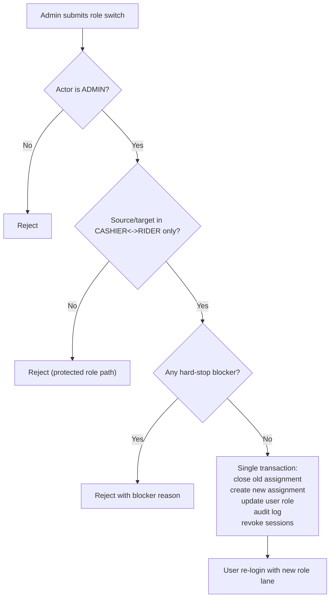

# Canonical Identity + Access Flow

Status: LOCKED
Owner: POS Platform
Last Reviewed: 2026-02-27

## Purpose

Defines canonical role authority boundaries for:

1. identity model (`User` and `Employee`)
2. route-level access control
3. operational/commercial authority ownership

This document is the binding authority for role boundaries.

## Core Identity Model

1. `Employee` is the person/profile record used by operations (rider assignment, names, staffing metadata).
2. `User` is the authentication/access record (`email`/`password`, role, active flag).
3. Canonical target mapping is one person to one account (`Employee` to `User` is 1:1 for active accounts).
4. `ADMIN` may exist without linked `Employee` because it is a control-plane role.
5. `CASHIER` uses the same email/password login contract as other roles.
6. Employee account creation requires email (`no email = no account`).
7. Employee account creation must capture one primary address using canonical geo masters (`Province`, `Municipality`, `Barangay`, optional `Zone`/`Landmark`).
8. Employee profile compliance fields are optional but tracked (`middleName`, `birthDate`, `sssNumber`, `pagIbigNumber`, `licenseNumber`, `licenseExpiry`).
9. Employee document scans are stored as document history per type (no overwrite): `VALID_ID`, `DRIVER_LICENSE_SCAN`, `BARANGAY_CLEARANCE`, `POLICE_CLEARANCE`, `NBI_CLEARANCE`, `PHOTO_2X2`, `RESUME`, `OTHER`.
10. Vehicle master records must support registration monitoring fields: `plateNumber`, `orNumber`, `crNumber`, `ltoRegistrationExpiry`.

## Employee + Vehicle Compliance Capture (Binding)

1. Compliance documents are metadata-first:
   - binary file is stored in storage driver (`local` or `s3`)
   - database stores `fileKey`, `fileUrl`, `mimeType`, `sizeBytes`, `uploadedBy`, `uploadedAt`, optional `expiresAt`
2. Upload history is immutable by default per document type (new upload adds a new history row).
3. Employee compliance remains monitoring-only in current phase: missing/expired docs must not block account creation, profile updates, or role switching.
4. Admin directory compliance badges currently monitor `VALID_ID` for all lanes plus rider license checks for current `RIDER` lane only.
5. `BARANGAY_CLEARANCE`, `POLICE_CLEARANCE`, and `NBI_CLEARANCE` are hiring/reference documents and must be stored without expiry tracking (`expiresAt = null`).
6. Optional HR documents (`POLICE_CLEARANCE`, `NBI_CLEARANCE`, `PHOTO_2X2`, `RESUME`, `BARANGAY_CLEARANCE`) are upload-ready but do not emit reminder badges by default.
7. Vehicle registration monitoring must highlight missing OR/CR/plate/expiry or expired LTO registration.

## Canonical Role Authority Matrix

| Role | Authority domain | Must never do |
| --- | --- | --- |
| `ADMIN` | Creation/control-plane only (master records, setup, account provisioning) | Enter operational money lanes, dispatch lanes, clearance decisions, remit close decisions, payroll settlement decisions |
| `STORE_MANAGER` | Operational and commercial authority (dispatch, clearance, remit, shift final-close, payroll decisions) | Delegate commercial decisions to cashier/rider/admin |
| `CASHIER` | Cash posting, remit encoding, shift submit, AR payment posting, charged-item acknowledgement | Perform manager commercial approvals or manager final-close decisions |
| `EMPLOYEE` (Rider lane) | Rider execution lanes (check-in facts, run view, shortage acknowledgement) | Perform manager/cashier approvals or commercial decisions |

## Route Group Authority (Canonical)

### A) Admin Creation/Setup Routes

Allowed role: `ADMIN` only.

Representative routes:

1. `app/routes/_index.tsx`
2. `app/routes/creation._index.tsx`
3. `app/routes/creation.employees.tsx`
4. `app/routes/creation.employees_.new.tsx`
5. `app/routes/creation.employees_.$employeeId.edit.tsx`
6. `app/routes/creation.riders.tsx`
7. `app/routes/creation.vehicles.tsx`
8. `app/routes/creation.areas.tsx`
9. `app/routes/creation.provinces.tsx`
10. `app/routes/customers._index.tsx`
11. `app/routes/customers.new.tsx`
12. `app/routes/customers.$id.tsx`
13. `app/routes/customers.$id_.edit.tsx`
14. `app/routes/customers.$id_.pricing.tsx`
15. `app/routes/customers.$id_.pricing_.$ruleId.tsx`

### B) Manager Operational/Commercial Routes

Allowed role: `STORE_MANAGER` only.

Representative routes:

1. `app/routes/store._index.tsx`
2. `app/routes/store.dispatch.tsx`
3. `app/routes/runs.$id.dispatch.tsx`
4. `app/routes/store.clearance.tsx`
5. `app/routes/store.clearance_.$caseId.tsx`
6. `app/routes/runs.$id.remit.tsx`
7. `app/routes/store.cashier-shifts.tsx`
8. `app/routes/store.cashier-variances.tsx`
9. `app/routes/store.cashier-ar.tsx`
10. `app/routes/store.payroll.tsx`

Hard rule:

1. `ADMIN` is not allowed in this route group, including read-only access.

### C) Cashier Money Lanes

Allowed role: `CASHIER` only, unless a route-level canonical doc explicitly states otherwise.

Representative routes:

1. `app/routes/cashier.$id.tsx`
2. `app/routes/cashier.delivery._index.tsx`
3. `app/routes/cashier.delivery.$runId.tsx`
4. `app/routes/delivery-remit.$id.tsx`
5. `app/routes/cashier.shift.tsx`
6. `app/routes/cashier.charges.tsx`
7. `app/routes/ar._index.tsx`
8. `app/routes/ar.customers.$id.tsx`

### D) Rider Execution Lanes

Allowed role: `EMPLOYEE` with rider-linked employee profile.

Representative routes:

1. `app/routes/rider._index.tsx`
2. `app/routes/rider.variances.tsx`
3. `app/routes/rider.variance.$id.tsx`
4. `app/routes/runs.$id.rider-checkin.tsx`
5. `app/routes/runs.$id.summary.tsx` (`mine` rider scope)

### E) Authentication + Recovery Routes

Allowed audience:

1. `login`: unauthenticated users.
2. `forgot-password` and `reset-password`: unauthenticated users with valid account email/token.

Representative routes:

1. `app/routes/login.tsx`
2. `app/routes/forgot-password.tsx`
3. `app/routes/reset-password.$token.tsx`

## Employee Role Lifecycle (Binding)

1. Role switching is immediate once approved and validated.
2. Only `ADMIN` may perform role switch actions.
3. System supports single active operational role per user at any time.
4. Normal role switching allows only:
   - `CASHIER -> RIDER`
   - `RIDER -> CASHIER`
5. Any switch involving `STORE_MANAGER` is blocked in normal role switch flow.
6. Manager role assignment/revocation is a protected governance action and must use a separate secured flow.

## Password Recovery (Binding)

1. Forgot-password is self-service for all active roles with valid account email.
2. Reset flow uses single-use, expiring token links delivered through configured SMTP.
3. Successful password reset must:
   - update `passwordHash`
   - clear legacy `pinHash`
   - increment `authVersion`
4. Reset responses must avoid account enumeration leaks.
5. New employee accounts must use invite-based setup:
   - admin creates account without entering password
   - system sets `authState = PENDING_PASSWORD`
   - system sends set-password email link
   - user becomes `ACTIVE` auth state only after password is set

## Manager Identity Model (Binding)

1. `STORE_MANAGER` remains a role on `User`, not a separate entity.
2. A manager may be:
   - `staff-manager`: linked to an `Employee` profile
   - `owner-manager`: no `Employee` link required
3. Both manager variants have identical operational/commercial authority.
4. Neither variant can be converted through normal cashier/rider switching flow.

## Role Switch Request Contract

Required input:

1. `employeeId`
2. `targetRole` (`CASHIER` or `RIDER`)
3. `reason`
4. `requestedByUserId` (must be `ADMIN`)

Validation rules:

1. Request actor must be `ADMIN`.
2. Source and target roles must be in `{CASHIER, RIDER}` only.
3. Source and target roles must be different.
4. If current role or target role is `STORE_MANAGER`, reject.
5. If employee or linked user is inactive, reject.

## Hard Stop Blockers (Immediate Switch)

Switch is rejected when any blocker exists:

1. Open cashier shift under target user identity.
2. Active run obligations tied to rider identity (assigned ongoing run/check-in duties).
3. Pending rider-acceptance tasks that require the current rider.
4. Any unresolved obligations defined by canonical manager/cashier/rider flow docs.

## Atomic Mutation + Audit Contract

All role switch writes must run in one transaction:

1. Close current active role assignment history row (`endedAt`).
2. Insert new role assignment history row (`startedAt`, `changedBy`, `reason`).
3. Update current active role on `User`.
4. Append immutable audit event (`beforeRole`, `afterRole`, actor, timestamp, reason).
5. Revoke active sessions for switched user (force re-login).

Failure rule:

1. If any step fails, commit nothing.

## Role Switch Flow (Canonical)

## Runtime Status (2026-02-27)

Implemented in `app/routes/creation.employees.tsx` (`intent = switch-role`):

1. Admin-only role switch endpoint.
2. Allowed lane transitions: `CASHIER <-> RIDER` only.
3. Protected manager role rejection (`STORE_MANAGER` not switchable in normal flow).
4. Immediate blocker checks before switch:
   - open cashier shift (cashier -> rider)
   - active rider runs (rider -> cashier)
   - pending rider variances (rider -> cashier)
5. Single transaction writes:
   - close active `UserRoleAssignment`
   - update `User.role` and linked `Employee.role`
   - append `UserRoleAssignment` and `UserRoleAuditEvent`
   - increment `authVersion`

Implemented in auth routes:

1. `app/routes/login.tsx` now enforces email/password for all roles, including `CASHIER`.
2. `app/routes/forgot-password.tsx` and `app/routes/reset-password.$token.tsx` provide self-service reset.
3. `app/routes/creation.employees_.new.tsx` handles invite-based setup (no admin-known default password) and initial onboarding payload.
4. `app/routes/creation.employees.tsx` is now the employee directory/manage surface (role switch, resend invite, activate/deactivate, compliance warnings).
5. `app/routes/creation.employees_.$employeeId.edit.tsx` handles employee profile and compliance updates with document history preserved.
6. Employee creation/edit routes capture one primary employee address and store both master references and snapshot text.
7. `app/routes/creation.vehicles.tsx` captures OR/CR/plate/LTO expiry metadata for registration monitoring.
8. Employee document policy is monitoring-only (non-blocking), with warning badges focused on `VALID_ID` and rider license signals.

## Cross-Doc Contract

1. This role-boundary SoT must be read together with:
   - `docs/guide/Commercial Clearance System V2`
   - `docs/guide/CANONICAL_DELIVERY_CASH_AR_FLOW.md`
   - `docs/guide/CANONICAL_CASHIER_SHIFT_VARIANCE_FLOW.md`
2. If any route-level flow doc conflicts on role authority, this file controls role/access interpretation.

## Known Implementation Drift (2026-02-26)

Canonical authority is already defined above, but current code still allows `ADMIN` access in some manager operational routes.

Access drift examples:

1. `app/routes/store._index.tsx`
2. `app/routes/store.dispatch.tsx`
3. `app/routes/runs.$id.dispatch.tsx`
4. `app/routes/store.clearance.tsx`
5. `app/routes/store.clearance_.$caseId.tsx`
6. `app/routes/runs.$id.remit.tsx`
7. `app/routes/store.cashier-shifts.tsx`
8. `app/routes/store.cashier-variances.tsx`
9. `app/routes/store.cashier-ar.tsx`
10. `app/routes/store.payroll.tsx`

Role lifecycle drift:

1. Global session invalidation using `authVersion` is not yet enforced across all route guards (runtime currently bumps `authVersion` during switch).

Follow-up code patch must:

1. Remove `ADMIN` from manager-route guards listed above.
2. Enforce `authVersion` session freshness globally to force immediate re-login after role switch.
