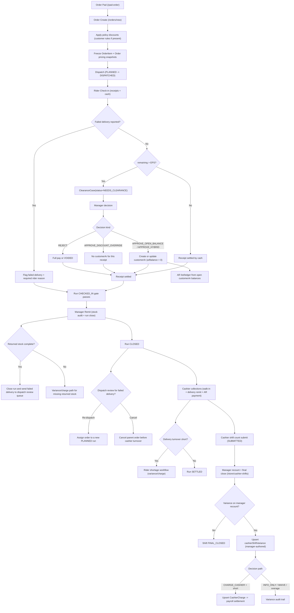
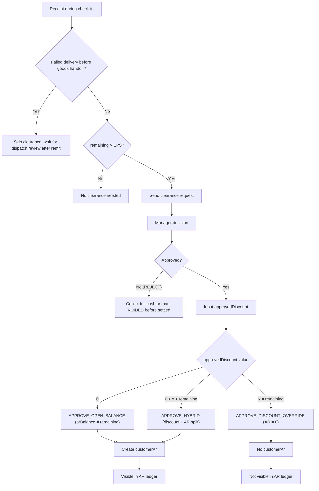
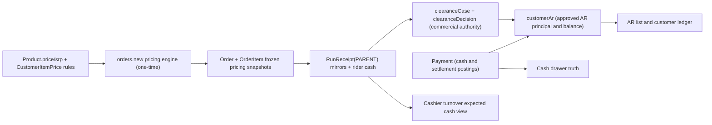
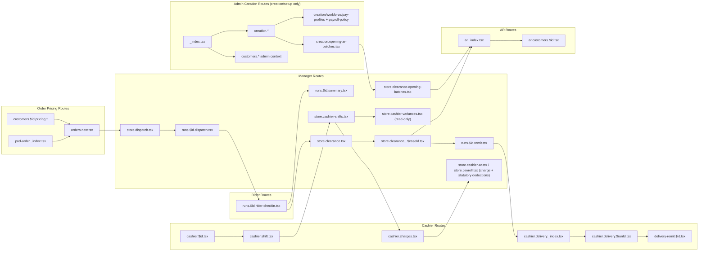
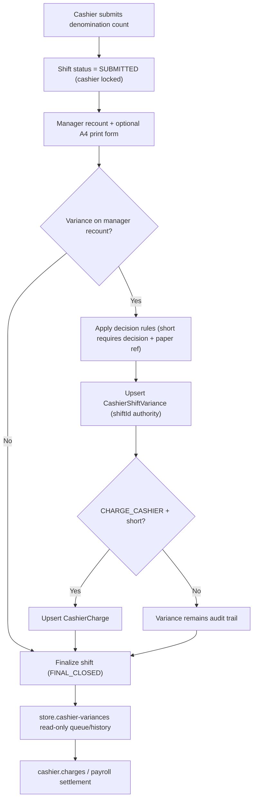

# Delivery + CSS + AR Diagrams

Status: LOCKED
Owner: POS Platform
Last Reviewed: 2026-03-25
Diagram Version: v3.2

## Purpose

Visual map for the canonical flow described in:

- `docs/guide/CANONICAL_IDENTITY_ACCESS_FLOW.md`
- `docs/guide/CANONICAL_ORDER_PRICING_SOT.md`
- `docs/guide/CANONICAL_DELIVERY_CASH_AR_FLOW.md`
- `docs/guide/CANONICAL_CASHIER_SHIFT_VARIANCE_FLOW.md`
- `docs/guide/CANONICAL_WORKER_PAYROLL_POLICY_AND_RUN_FLOW.md`
- `docs/guide/Commercial Clearance System V2`
- `docs/guide/Accounts Receivable — Canonical Source of Truth (SoT)`

## 1) End-to-End Flow

```mermaid
flowchart TD
    A0["Order Pad (/pad-order)"] --> A1["Order Create (/orders/new)"]
    A1 --> A2["Apply policy discounts (customer rules if present)"]
    A2 --> A3["Freeze OrderItem + Order pricing snapshots"]
    A3 --> A["Dispatch (PLANNED -> DISPATCHED)"]
    A --> B["Rider Check-in (receipts + cash)"]
    B --> B1{"Failed delivery reported?"}
    B1 -- "Yes" --> B2["Flag failed delivery + required rider reason"]
    B1 -- "No" --> C{"remaining > EPS?"}
    C -- "No" --> D["Receipt settled by cash"]
    C -- "Yes" --> E["ClearanceCase(status=NEEDS_CLEARANCE)"]
    E --> F["Manager decision"]
    F --> G{"Decision kind"}
    G -- "APPROVE_OPEN_BALANCE / APPROVE_HYBRID" --> H["Create or update customerAr (arBalance > 0)"]
    G -- "APPROVE_DISCOUNT_OVERRIDE" --> I["No customerAr for this receipt"]
    G -- "REJECT" --> J["Full pay or VOIDED"]
    D --> K["Receipt settled"]
    H --> K
    I --> K
    J --> K
    K --> L["Run CHECKED_IN gate passes"]
    B2 --> L
    L --> M["Manager Remit (stock audit + run close)"]
    M --> M1{"Returned stock complete?"}
    M1 -- "Yes" --> M2["Close run and send failed delivery to dispatch review queue"]
    M1 -- "No" --> M3["Variance/charge path for missing returned stock"]
    M --> N["Run CLOSED"]
    N --> N1{"Dispatch review for failed delivery?"}
    N1 -- "Re-dispatch" --> N2["Assign order to a new PLANNED run"]
    N1 -- "Cancel" --> N3["Cancel parent order before cashier turnover"]
    N --> O["Cashier collections (walk-in + delivery remit + AR payment)"]
    O --> P{"Delivery turnover short?"}
    P -- "Yes" --> Q["Rider shortage workflow (variance/charge)"]
    P -- "No" --> R["Run SETTLED"]
    O --> S["Cashier shift count submit (SUBMITTED)"]
    S --> T["Manager recount + final close (/store/cashier-shifts)"]
    T --> U{"Variance on manager recount?"}
    U -- "No" --> V["Shift FINAL_CLOSED"]
    U -- "Yes" --> W["Upsert cashierShiftVariance (manager-authored)"]
    W --> X{"Decision path"}
    X -- "CHARGE_CASHIER + short" --> Y["Upsert CashierCharge -> payroll settlement"]
    X -- "INFO_ONLY / WAIVE / overage" --> Z["Variance audit trail"]
    H --> AA["AR list/ledger from open customerAr balances"]
```

## 2) Clearance Decision Tree

```mermaid
flowchart TD
    A["Receipt during check-in"] --> A1{"Failed delivery before goods handoff?"}
    A1 -- "Yes" --> A2["Skip clearance; wait for dispatch review after remit"]
    A1 -- "No" --> B{"remaining > EPS?"}
    B -- "No" --> C["No clearance needed"]
    B -- "Yes" --> D["Send clearance request"]
    D --> E["Manager decision"]
    E --> F{"Approved?"}
    F -- "No (REJECT)" --> G["Collect full cash or mark VOIDED before settled"]
    F -- "Yes" --> H["Input approvedDiscount"]
    H --> I{"approvedDiscount value"}
    I -- "0" --> J["APPROVE_OPEN_BALANCE (arBalance = remaining)"]
    I -- "0 < x < remaining" --> K["APPROVE_HYBRID (discount + AR split)"]
    I -- "x = remaining" --> L["APPROVE_DISCOUNT_OVERRIDE (AR = 0)"]
    J --> M["Create customerAr"]
    K --> M
    L --> N["No customerAr"]
    M --> O["Visible in AR ledger"]
    N --> P["Not visible in AR ledger"]
```

## 3) Source of Truth Ownership

```mermaid
flowchart LR
    A["Product.price/srp + CustomerItemPrice rules"] --> B["orders.new pricing engine (one-time)"]
    B --> C["Order + OrderItem frozen pricing snapshots"]
    C --> D["RunReceipt(PARENT) mirrors + rider cash"]
    D --> E["clearanceCase + clearanceDecision (commercial authority)"]
    E --> F["customerAr (approved AR principal and balance)"]
    G["Payment (cash and settlement postings)"] --> F
    D --> H["Cashier turnover expected cash view"]
    G --> I["Cash drawer truth"]
    F --> J["AR list and customer ledger"]
```

## 4) Route-Level Swimlane

```mermaid
flowchart LR
    subgraph Admin["Admin Creation Routes (creation/setup only)"]
        AD0["_index.tsx"]
        AD1["creation.*"]
        AD4["creation/workforce/pay-profiles + payroll-policy"]
        AD2["customers.* admin context"]
        AD3["creation.opening-ar-batches.tsx"]
    end

    subgraph POS["Order Pricing Routes"]
        P0["pad-order._index.tsx"]
        P1["orders.new.tsx"]
        P2["customers.$id.pricing.*"]
    end

    subgraph Manager["Manager Routes"]
        M0["store.dispatch.tsx"]
        M1["runs.$id.dispatch.tsx"]
        M2["runs.$id.summary.tsx"]
        M3["store.clearance.tsx"]
        M4["store.clearance_.$caseId.tsx"]
        M5["runs.$id.remit.tsx"]
        M6["store.cashier-shifts.tsx"]
        M7["store.cashier-variances.tsx (read-only)"]
        M8["store.cashier-ar.tsx / store.payroll.tsx (charge + statutory deductions)"]
        M9["store.clearance-opening-batches.tsx"]
    end

    subgraph Rider["Rider Routes"]
        R1["runs.$id.rider-checkin.tsx"]
    end

    subgraph Cashier["Cashier Routes"]
        C1["cashier.delivery._index.tsx"]
        C2["cashier.delivery.$runId.tsx"]
        C3["delivery-remit.$id.tsx"]
        C4["cashier.$id.tsx"]
        C5["cashier.shift.tsx"]
        C6["cashier.charges.tsx"]
    end

    subgraph AR["AR Routes"]
        A1["ar._index.tsx"]
        A2["ar.customers.$id.tsx"]
    end

    AD0 --> AD1
    AD1 --> AD4
    AD0 --> AD2
    AD1 --> AD3 --> M9
    P0 --> P1 --> M0
    P2 --> P1
    M0 --> M1 --> R1 --> M2
    R1 --> M3 --> M4 --> M5
    M5 --> C1 --> C2 --> C3
    C4 --> C5 --> M6 --> C6 --> M8
    M6 --> M7
    M4 --> A1 --> A2
    M9 --> A1
```

Authority note:

1. `Admin` lane is creation/setup only.
2. `Manager` lane represents `STORE_MANAGER`-only operational/commercial authority.
3. `ADMIN` must not enter `Manager` lane routes, including read-only access.

## 5) Route-to-SoT Matrix (Condensed)

| Route | SoT read/write anchor |
| --- | --- |
| `pad-order._index.tsx` | client cart/preflight only (not final pricing authority) |
| `orders.new.tsx` | policy discount engine apply + frozen `order/orderItem` pricing snapshots |
| `runs.$id.rider-checkin.tsx` | `runReceipt`, `deliveryRunOrder.attemptOutcome` rider report, `clearanceCase` |
| `store.clearance_.$caseId.tsx` | `clearanceDecision`, `customerAr` |
| `creation.opening-ar-batches.tsx` | admin staging of opening balance rows into pending `clearanceCase` only |
| `store.clearance-opening-batches.tsx` | manager bulk decision lane (`clearanceDecision`, `customerAr`) |
| `runs.$id.remit.tsx` | stock recap + failed-delivery stock verification + run close records |
| `cashier.delivery.$runId.tsx` | turnover comparison (`runReceipt.cashCollected` vs `payment`) |
| `delivery-remit.$id.tsx` | per-order `payment` + shortage bridge records |
| `cashier.$id.tsx` | walk-in cash posting to `payment` (shift-tagged) |
| `cashier.shift.tsx` | shift status transitions + close count submission |
| `store.cashier-shifts.tsx` | manager recount/final-close authority, variance upsert, charge decision write path |
| `store.cashier-variances.tsx` | read-only variance queue/history |
| `cashier.charges.tsx` | cashier acknowledgement trail for charged variances |
| `store.cashier-ar.tsx` | cashier charge list and payroll-tag planning |
| `store.payroll.tsx` | manager payroll-run review, government-deduction visibility, charge deduction posting, and payroll-run status freeze |
| `creation.workforce.pay-profiles.tsx` | admin employee payroll setup: daily salary history and employee-specific deduction setup |
| `creation.workforce.payroll-policy.tsx` | admin payroll defaults, incentive rules, and government-deduction inclusion switches |
| `ar._index.tsx` | customer AR list authority |
| `ar.customers.$id.tsx` | customer AR ledger/payments |

## 5b) Security Access Gate Addendum (Approved 2026-03-12)

Target route authority to be enforced by follow-up code patch:

1. `/pad-order`, `/orders/new`:
   - allowed: `CASHIER`, `STORE_MANAGER`, `EMPLOYEE`
   - denied: `ADMIN`
   - never public
2. `/orders/:id/slip`, `/orders/:id/ticket`, `/orders/:id/receipt`:
   - allowed: `CASHIER`, `STORE_MANAGER`, `EMPLOYEE`
   - denied: `ADMIN`
   - never public
3. Retired legacy routes `/orders/:id/ack` and `/orders/:id/credit` must not be reintroduced.
4. Admin control-plane mutations remain admin-only:
   - `/products*`
   - `/resources/creation/upsert`
   - `/resources/creation/delete`
   - `/target/check`
   - `/indication/check`
   - `/api/customers/create`

## 5c) Legacy Receipt Route Retirement (Applied 2026-03-12)

Legacy non-canonical route chain was removed from code:

1. `app/routes/remit-summary.$id.tsx`
2. `app/routes/remit-receipt.$id.tsx`
3. `app/routes/receipts._index.tsx`
4. `app/routes/orders.$id.ack.tsx`
5. `app/routes/orders.$id.credit.tsx`

Diagram authority remains unchanged:

1. Cashier print/payment proof path uses `orders.$id.receipt.tsx` from active cashier posting lanes.
2. AR proof printing remains in `ar.customers.$id.tsx`.
3. No new node/hand-off was introduced by this cleanup.

## 5d) Slip vs Ticket vs Receipt Semantics (Binding)

1. `orders.$id.slip.tsx` = pickup order slip.
2. `orders.$id.ticket.tsx` = delivery ticket (address/maps/rider handoff sheet).
3. `orders.$id.receipt.tsx` = settlement/collection proof.
4. Channel handoff from `orders.new.tsx`: pickup -> slip, delivery -> ticket.
5. `pad-order._index.tsx` UI should reflect this handoff (pickup lane shows slip cue, delivery lane shows ticket cue).

## 6) Cashier Shift Audit Path (Current)

```mermaid
flowchart TD
    A["Cashier submits denomination count"] --> B["Shift status = SUBMITTED (cashier locked)"]
    B --> C["Manager recount + optional A4 print form"]
    C --> D{"Variance on manager recount?"}
    D -- "No" --> E["Finalize shift (FINAL_CLOSED)"]
    D -- "Yes" --> F["Apply decision rules (short requires decision + paper ref)"]
    F --> G["Upsert CashierShiftVariance (shiftId authority)"]
    G --> H{"CHARGE_CASHIER + short?"}
    H -- "Yes" --> I["Upsert CashierCharge"]
    H -- "No" --> J["Variance remains audit trail"]
    I --> E
    J --> E
    E --> K["store.cashier-variances read-only queue/history"]
    K --> L["cashier.charges / payroll settlement"]
```

As-implemented control note:

1. Manager decision and variance write path live in `store.cashier-shifts.tsx` during final close.
2. `store.cashier-variances.tsx` is read-only for audit visibility.
3. Short variance close requires decision plus paper reference.
4. A4 variance form is printable from manager shift panel and supports paper reference capture.

## Diagram Upgrade Rule

1. Minor (`v1.x`) for additive nodes/links without rule changes.
2. Major (`v2.0`) when business rules or SoT authority changes.
3. Any major update must also update:
   - `docs/guide/CANONICAL_IDENTITY_ACCESS_FLOW.md`
   - `docs/guide/CANONICAL_ORDER_PRICING_SOT.md`
   - `docs/guide/CANONICAL_DELIVERY_CASH_AR_FLOW.md`
   - `docs/guide/CANONICAL_CASHIER_SHIFT_VARIANCE_FLOW.md`
   - `docs/guide/Accounts Receivable — Canonical Source of Truth (SoT)`

## Known Implementation Drift (2026-03-05)

Canonical diagram `v2.0` enforces admin separation from manager lanes.
Current code still allows `ADMIN` in some manager routes and requires follow-up alignment:

1. `app/routes/store.dispatch.tsx`
2. `app/routes/runs.$id.dispatch.tsx`
3. `app/routes/runs.$id.remit.tsx`
4. `app/routes/store.cashier-shifts.tsx`
5. `app/routes/store.cashier-variances.tsx`
6. `app/routes/store.cashier-ar.tsx`
