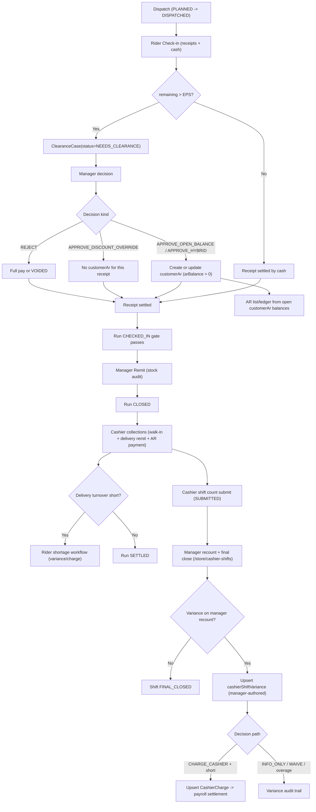
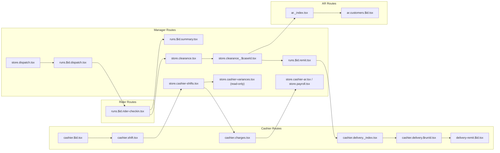

# Delivery + CSS + AR Diagrams

Status: LOCKED
Owner: POS Platform
Last Reviewed: 2026-02-20
Diagram Version: v1.2

## Purpose

Visual map for the canonical flow described in:

- `docs/guide/CANONICAL_DELIVERY_CASH_AR_FLOW.md`
- `docs/guide/CANONICAL_CASHIER_SHIFT_VARIANCE_FLOW.md`
- `docs/guide/Commercial Clearance System V2`
- `docs/guide/Accounts Receivable — Canonical Source of Truth (SoT)`

## 1) End-to-End Flow

## 2) Clearance Decision Tree

## 3) Source of Truth Ownership

## 4) Route-Level Swimlane

## 5) Route-to-SoT Matrix (Condensed)

| Route | SoT read/write anchor |
| --- | --- |
| `runs.$id.rider-checkin.tsx` | `runReceipt`, `clearanceCase` |
| `store.clearance_.$caseId.tsx` | `clearanceDecision`, `customerAr` |
| `runs.$id.remit.tsx` | stock recap + run close records |
| `cashier.delivery.$runId.tsx` | turnover comparison (`runReceipt.cashCollected` vs `payment`) |
| `delivery-remit.$id.tsx` | per-order `payment` + shortage bridge records |
| `cashier.$id.tsx` | walk-in cash posting to `payment` (shift-tagged) |
| `cashier.shift.tsx` | shift status transitions + close count submission |
| `store.cashier-shifts.tsx` | manager recount/final-close authority, variance upsert, charge decision write path |
| `store.cashier-variances.tsx` | read-only variance queue/history |
| `cashier.charges.tsx` | cashier acknowledgement trail for charged variances |
| `store.cashier-ar.tsx` | cashier charge list and payroll-tag planning |
| `store.payroll.tsx` | payroll deduction posting and status synchronization |
| `ar._index.tsx` | customer AR list authority |
| `ar.customers.$id.tsx` | customer AR ledger/payments |

## 6) Cashier Shift Audit Path (Current)

As-implemented control note:

1. Manager decision and variance write path live in `store.cashier-shifts.tsx` during final close.
2. `store.cashier-variances.tsx` is read-only for audit visibility.
3. Short variance close requires decision plus paper reference.
4. A4 variance form is printable from manager shift panel and supports paper reference capture.

## Diagram Upgrade Rule

1. Minor (`v1.x`) for additive nodes/links without rule changes.
2. Major (`v2.0`) when business rules or SoT authority changes.
3. Any major update must also update:
   - `docs/guide/CANONICAL_DELIVERY_CASH_AR_FLOW.md`
   - `docs/guide/CANONICAL_CASHIER_SHIFT_VARIANCE_FLOW.md`
   - `docs/guide/Accounts Receivable — Canonical Source of Truth (SoT)`
